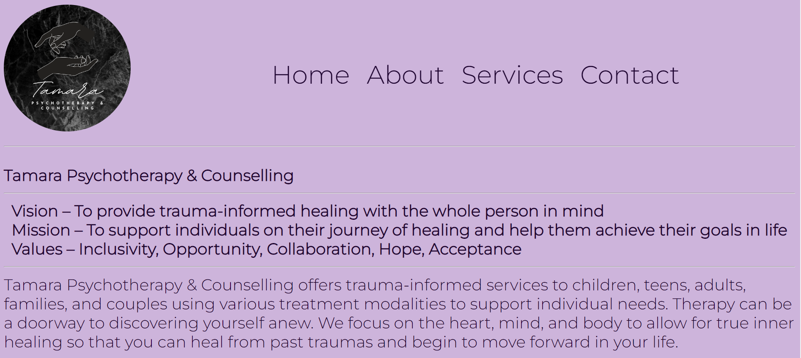

# TamaraPsychotherapy

## User Story
With this webstie the user will be able to access information about Tamara Psychotherapy. This will give them information about the therapist and also resources available from the therapist and blogs written by the therapist. The user will be able to copntact the therapist and also access the Jane app calendar of the therapist to book sessions with them. 

## Description
This website uses html5, css and javascript to function. No Databases being used as no information is needed to be stored. fonts are sourced from google fontrs and any and all images will be sourced locally. Logo is designed using canva.

### Installation
N/A 

### Links
Github: https://github.com/nettodev360/TamaraPsychotherapy

Deployed url:  https://nettodev360.github.io/TamaraPsychotherapy/

### Final render image

